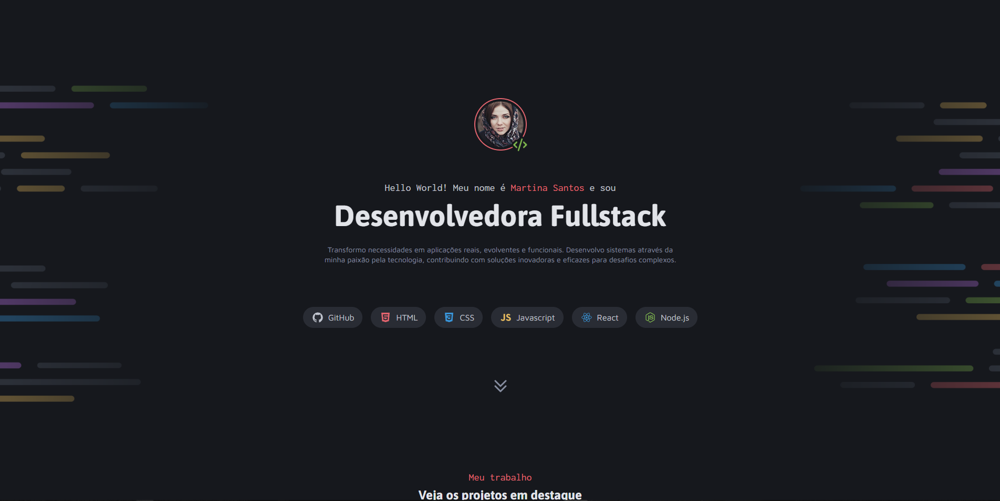
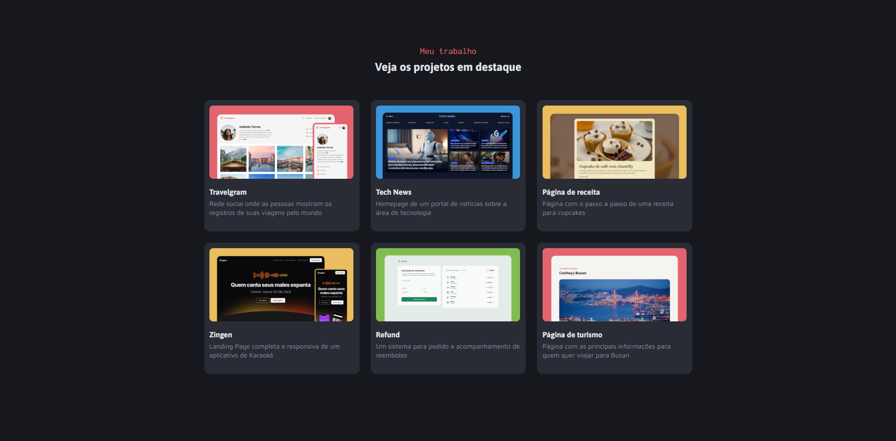
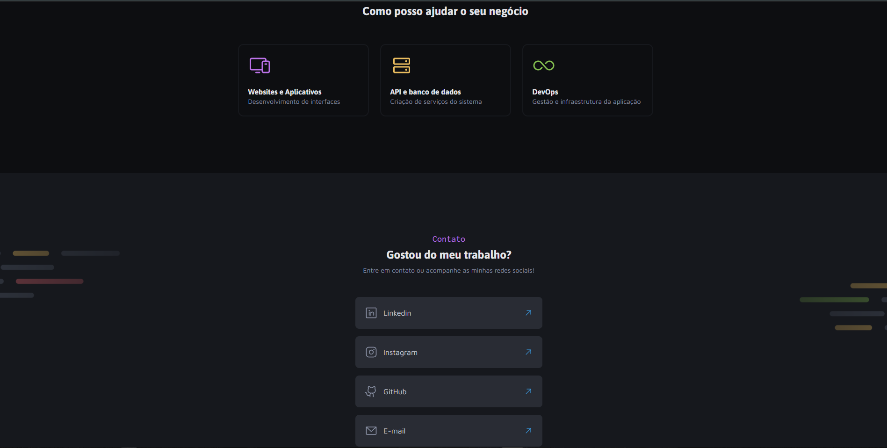

##🌎 Projeto Portifóleo Dev | Rocketseat




## 📝 Sobre o Projeto
Este projeto é um portfólio dev criado a partir de um design no Figma.
O objetivo foi praticar com foco em código limpo, organizado e otimizado, além da implementação de animações suaves para criar uma interface moderna, responsiva e bem estruturada.

🚀 Tecnologias utilizadas:
 - HTML5 - ESTRUTURA DAS PAGINAS
 - CSS3 - ESTILIZAÇÃO E LAYOUT
 - GIT - VERSIONAMENTO DE CODIGO

 🎯 Funcionalidades:
 - Seção com cards funcionais e bem animados.
 - Componentes visuais reutilizáveis.
 - Estrutura limpa e organizada.

_______________________________________________________________________________________________________________________________

## 👤 Sobre mim
Olá! Meu nome é **Nicolas**, tenho 14 anos e estou estudando programação com foco em **desenvolvimento front-end**.  
Atualmente estou aprendendo e evoluindo em:

- HTML5  
- CSS3  
- JavaScript  
- Responsividade  
- Git e GitHub

Gosto de criar projetos limpos, bem estruturados e sempre busco melhorar a organização do código, seguindo boas práticas.

_______________________________________________________________________________________________________________________________

📬 Contato

Caso queira conversar, tirar dúvidas ou conhecer outros projetos:

- 📧 itadori7zxwm@gmail.com

- 📧 nicolasdev703@gmail.com


🛠️ Como executar o projeto
Para clonar e rodar localmente:

```bash
git clone URL_DO_REPOSITORIO
cd pasta-do-projeto
# Abra o arquivo index.html no navegador

